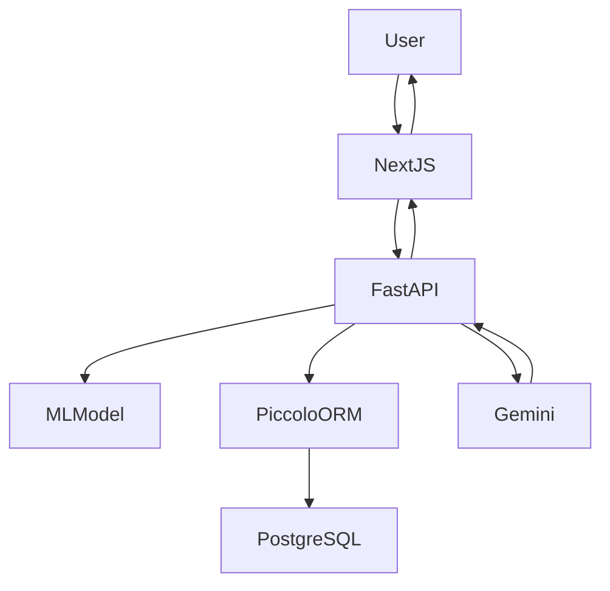
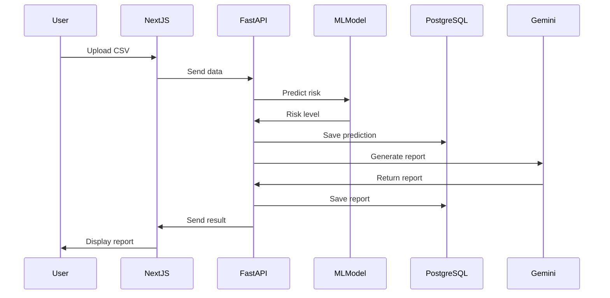

# Product Requirements Document (PRD)

# FleetAI – Vehicle Maintenance Prediction and Agentic Fleet Management System

---

# 1. Overview

## 1.1 Product Name

FleetAI

## 1.4 Dataset
[Vehicle Maintenance Data (Kaggle)](https://www.kaggle.com/datasets/chavindudulaj/vehicle-maintenance-data)

---

## 1.2 Product Vision

FleetAI is an AI-powered fleet analytics and maintenance intelligence platform designed to:

• Predict vehicle maintenance risk
• Prevent unexpected failures
• Generate AI-driven maintenance recommendations
• Assist fleet managers in decision-making

The system combines Machine Learning, Agentic AI, and modern web technologies.

---

# 1.3 Objectives

Primary Objectives:

• Predict maintenance risk using ML
• Store and track vehicle health data
• Generate maintenance recommendations using Gemini AI
• Provide modern dashboard using Next.js

Secondary Objectives:

• Maintain vehicle maintenance history
• Provide structured maintenance reports
• Enable scalable fleet management

---

# 2. Users

## Primary Users

Fleet Managers

Responsibilities:

• Monitor fleet health
• Schedule maintenance

---

## Secondary Users

Maintenance Teams

Responsibilities:

• Perform servicing
• Follow recommendations

---

# 3. Tech Stack

## Frontend

Next.js 16

Responsibilities:

• Dashboard UI
• CSV Upload
• Report display

---

## Backend

FastAPI

Responsibilities:

• ML prediction
• Database interaction
• Gemini integration

---

## Database

PostgreSQL

Responsibilities:

• Persistent data storage

---

## ORM

Piccolo ORM

Responsibilities:

• Database abstraction
• Query handling
• Migrations

---

## Machine Learning

scikit-learn

Responsibilities:

• Train maintenance prediction model
• Predict risk

Output:

model.pkl

---

## AI Integration

Gemini 3 Flash (Free Tier)

Responsibilities:

• Generate maintenance reports
• Provide recommendations

## Agent Framework

LangGraph

Responsibilities:

• Orchestrate agentic workflow
• Manage state between retrieval and generation

---

## Vector Database

Pinecone

Responsibilities:

• Store maintenance knowledge
• Enable RAG (Retrieval Augmented Generation)

---

# 4. Functional Requirements

---

# FR-1 Vehicle Data Upload

User uploads:

CSV file containing:

• mileage
• engine hours
• repair history

System shall:

• Validate file
• Store vehicle data

---

# FR-2 Maintenance Risk Prediction

System shall:

• Load ML model
• Predict risk level

Output:

Low
Medium
High

• Feature Importance (Top contributing factors)

---

# FR-3 Prediction Storage

System shall store:

vehicle_id
risk_level
prediction_date

---

# FR-4 Maintenance Report Generation

System shall:

• Retrieve maintenance concepts/guidelines from Vector DB (RAG)
• Send vehicle data + retrieved context to Gemini
• Generate report

Report includes:

• Vehicle health summary
• Maintenance actions
• Timeline
• Disclaimer

---

# FR-5 Maintenance History Tracking

System shall store:

• previous predictions
• previous reports

---

# FR-6 Dashboard

Frontend shall display:

• Vehicle list
• Risk level

• Feature Importance (Key factors)
• Reports

---

# 5. Non-Functional Requirements

---

# Performance

Prediction time:

< 3 seconds

---

# Scalability

System shall support:

1000+ vehicles

---

# Reliability

System uptime:

99%

---

# Security

API keys stored in:

Environment variables

---

# 6. Database Design

---

# Vehicle Table

Fields:

id
name
mileage
engine_hours
created_at

---

# Prediction Table

Fields:

id
vehicle_id
risk_level
prediction_date

---

# Report Table

Fields:

id
vehicle_id
report_text
created_at

---

# 7. System Architecture

---

## High Level Architecture

Frontend:

Next.js

Backend:

FastAPI

Database:

PostgreSQL

AI:

Gemini

---

## Architecture Diagram

---

# 8. Data Flow

---

---

# 9. API Design

---

# POST /vehicles

Create vehicle

---

# GET /vehicles

Get all vehicles

---

# POST /predict

Predict maintenance risk

---

# POST /report

Generate maintenance report

---

# GET /report/{vehicle_id}

Get maintenance report

---

# 10. Deployment

---

# Frontend

Platform:

Vercel

---

# Backend

Platform:

Render

---

# Database

Platform:

Neon PostgreSQL

---

# 11. Milestone Mapping

---

# Milestone 1

Deliverables:

ML prediction

Feature Importance visualization
Basic UI

---

# Milestone 2

Deliverables:

Gemini integration
Agentic reports

---

# 12. Risks

---

Risk:

Incorrect prediction

Mitigation:

Model training improvement

---

Risk:

Gemini API failure

Mitigation:

Fallback response

---

# 13. Success Metrics

---

Accuracy:

> 80%

---

Prediction speed:

< 3 seconds

---

System uptime:

> 99%

---

# 14. Future Enhancements

---

Predictive maintenance scheduling

Fleet optimization

Mobile app

---

# END OF PRD
