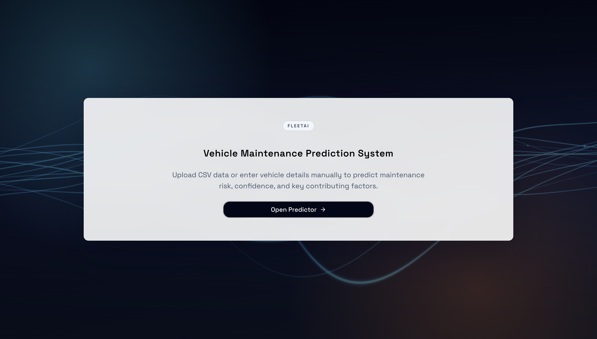

# FleetAI — Vehicle Maintenance Prediction System

> Predict vehicle maintenance risk from telemetry data using a tuned Random Forest pipeline, a deterministic insight engine, and an optional Google Gemini layer.

[](https://www.python.org/)
[](https://fastapi.tiangolo.com/)
[](https://nextjs.org/)
[](https://scikit-learn.org/)

---

## Demo



**Live deployment:**
- Frontend: [https://vehicle-aiml.vercel.app](https://vehicle-aiml.vercel.app)
- Backend API docs: [https://vehicle-aiml-backend.vercel.app/docs](https://vehicle-aiml-backend.vercel.app/docs)

---

## Model Performance

Trained on the [Vehicle Maintenance Data](https://www.kaggle.com/datasets/chavindudulaj/vehicle-maintenance-data) dataset (50,000 synthetic records, 19 features).

| Metric | Test Set | 5-Fold CV (mean ± std) |
|---|---|---|
| Accuracy | **94.07%** | 93.91% ± 0.21% |
| ROC-AUC | **1.00** | 1.00 ± 0.00 |

> **Note on ROC-AUC:** The perfect score is a known characteristic of this synthetic dataset — the feature distributions are generated with strong separation between classes. Results on real-world fleet data will differ. See `model/data_processing.ipynb` for the full leakage investigation.

**Risk thresholds:**

| Level | Probability |
|---|---|
| `LOW` | < 0.30 |
| `MEDIUM` | 0.30 – 0.69 |
| `HIGH` | ≥ 0.70 |

To reproduce these numbers:

```bash
pip install kagglehub scikit-learn pandas joblib
python model/train.py
```

Outputs `model/vehicle_maintenance_pipeline.pkl` and `model/metrics.json`.

---

## What Milestone-1 Delivers

- FastAPI backend with sklearn pipeline inference
- Next.js frontend with manual and CSV prediction flows
- Risk classification (`LOW | MEDIUM | HIGH`)
- Confidence score and risk probability
- Global model feature importance
- Row-level meaningful insight (drivers, recommendations, warnings)

---

## System Architecture

```text
frontend (Next.js)  --->  backend (FastAPI /predict)
                           |
                           ---> model/vehicle_maintenance_pipeline.pkl
```

---

## Meaningful Insight

Every prediction response includes both model output and an operational explanation:

| Field | Description |
|---|---|
| `risk_probability` | Model probability of HIGH-risk class |
| `confidence` | `max(p, 1 - p)` |
| `insight_summary` | Short interpretation sentence |
| `insight_drivers[]` | Row-specific factors with direction (`RISK_UP`, `RISK_DOWN`, `NEUTRAL`) and impact score |
| `recommendations[]` | Actionable maintenance steps with priority |
| `data_warnings[]` | Warnings for out-of-range telemetry |
| `insight_source` | `RULES` or `GENAI_LLM` |

**GenAI path (optional):**
- Set `ENABLE_LLM_INSIGHTS=true` and `GOOGLE_API_KEY` to augment summaries via LangChain + Google Gemini.
- Falls back to deterministic rule-based insights if not configured.
- LangChain is **not** a core dependency — install separately with `pip install -r backend/requirements-llm.txt`.

---

## Repository Structure

```text
backend/
  app/
    api/predict.py            # /predict endpoint (JSON + CSV)
    services/
      prediction_service.py   # ML inference + rule-based insight engine
      llm_insight_service.py  # Optional GenAI layer (LangChain + Gemini)
    schemas/prediction.py     # Pydantic request/response models
    main.py
  tests/                      # pytest suite
  requirements.txt            # Core deps (no LangChain)
  requirements-llm.txt        # Optional LLM deps
frontend/
  src/app/predict/page.tsx
  src/services/predictionService.ts
  src/types/prediction.ts
model/
  train.py                    # Reproducible training script
  data_processing.ipynb       # EDA + model selection notebook
  vehicle_maintenance_pipeline.pkl
  metrics.json                # Generated by train.py
api/
  index.py                    # Vercel backend entrypoint
vercel.json
requirements.txt              # Vercel backend deps (slim)
```

---

## Local Development

### Backend

```bash
cd backend
python -m venv .venv
source .venv/bin/activate
pip install -r requirements.txt
PYTHONPATH=backend uvicorn app.main:app --reload --host 0.0.0.0 --port 8000
```

### Frontend

```bash
cd frontend
npm install
echo "NEXT_PUBLIC_API_BASE_URL=http://localhost:8000" > .env.local
npm run dev
```

Open `http://localhost:3000/predict`.

### Tests

```bash
PYTHONPATH=backend pytest -q backend/tests
```

---

## API Contract

### `GET /health`

Returns `{"status": "ok"}`. Use as a liveness probe.

### `GET /metrics`

Returns model evaluation metrics from `model/metrics.json` (generated by `model/train.py`).

```json
{
  "accuracy": 0.9407,
  "roc_auc": 1.0,
  "cv_folds": 5,
  "cv_accuracy_mean": 0.9391,
  "cv_accuracy_std": 0.0021,
  "cv_roc_auc_mean": 1.0,
  "cv_roc_auc_std": 0.0
}
```

Returns `404` with a guidance message if `train.py` has not been run yet.

### `POST /predict` — JSON

```json
{
  "mileage": 64000,
  "engine_hours": 1200,
  "fault_codes": "P0171,P0420",
  "service_history": "average",
  "usage_patterns": "mixed city driving"
}
```

Response:

```json
{
  "risk_level": "LOW",
  "risk_probability": 0.1751,
  "confidence": 0.8249,
  "feature_importance": { "reported_issues": 0.3051 },
  "insight_summary": "Estimated failure-risk probability is 17.51% (LOW)...",
  "insight_drivers": [
    {
      "factor": "Reported issues",
      "observed_value": "1 active fault code",
      "direction": "RISK_UP",
      "impact": 0.42,
      "explanation": "A single active fault code adds moderate risk."
    }
  ],
  "recommendations": [
    {
      "priority": "MEDIUM",
      "action": "Run full diagnostic scan and resolve active fault codes.",
      "rationale": "Active fault codes are one of the strongest maintenance risk drivers."
    }
  ],
  "data_warnings": [],
  "total_records": 1,
  "predictions": null,
  "metadata": null
}
```

### `POST /predict` — CSV upload

Multipart field `file` (`.csv`). Required columns: `mileage`, `engine_hours`, `fault_codes`, `service_history`, `usage_patterns`.

Batch response includes `predictions[]` and a top-level summary of the highest-risk row.

---

## Deploy to Vercel

Use **two separate Vercel projects** from the same repo.

### Backend project

- Root: repository root (`/`)
- Includes `api/index.py`, `vercel.json`, `requirements.txt`, `model/vehicle_maintenance_pipeline.pkl`

```bash
vercel --prod
```

Optional env vars:

```
ENABLE_LLM_INSIGHTS=true
GOOGLE_API_KEY=<your-key>
GENAI_MODEL=gemini-1.5-flash
```

Verify: `https://<backend-domain>/health`

### Frontend project

- Root: `frontend/`
- Env var: `NEXT_PUBLIC_API_BASE_URL=https://<backend-domain>`

```bash
cd frontend && vercel --prod
```

---

## Team

**DataRiders** — Harsh Hirawat, Nitya Jain, Atharv Soni, Ishita Singh
